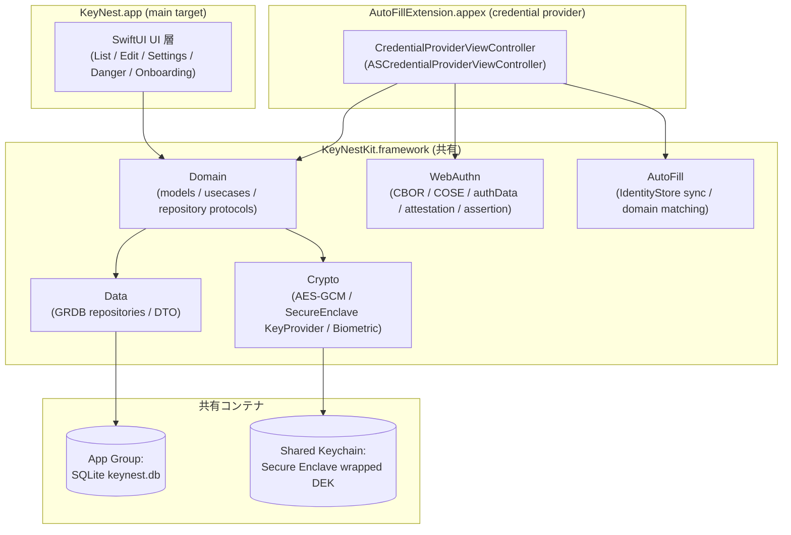

# Design — KeyNest iOS 移植（基盤フェーズ）

## Overview

KeyNest は Android のオフライン専用パスワードマネージャ **KeyNest**（`../KeyNest`）の iOS 移植版である。
元アプリの「全データを端末内のみで保管し、AES-256-GCM ＋ ハードウェア鍵で暗号化、OS の自動入力／
PassKey プロバイダとして機能する」という価値を、iOS の `AuthenticationServices`・`CryptoKit`・
`LocalAuthentication`・`SQLite(GRDB)` の上に **動作等価**で再構築する。

元アプリのうち **ドメイン/ユースケース・暗号ペイロード形式・WebAuthn のバイトレイアウト・画面の情報設計・
ローカライズ** はほぼそのまま移植できる。一方 **自動入力のターゲティング方式**（Android はパッケージ名＋
署名 SHA-256 で照合）は iOS に同概念が無いため、**Web ドメイン基盤**に作り替える。これが本移植の最大の
設計差分である。

対象ユーザー: KeyNest と同じく「ローカル保管を重視する個人」。インパクト: iOS ユーザーへ同等の保管・自動入力・
PassKey 体験を提供する。

## Goals / Non-Goals

### Goals
- パスワード保管 CRUD・暗号化・生体アンロックの動作等価
- iOS ネイティブ AutoFill（パスワード）プロバイダとして実際にフィールド入力が発火する
- iOS 17+ の PassKey プロバイダ（登録/認証）として動作し、WebAuthn のバイト列は KeyNest と一致
- カスタムフィールド・複製・並び替え・検索・Vault メタデータ・危険ゾーンの機能パリティ
- EN/JA ローカライズ、Manrope/JetBrains Mono、ライト/ダーク

### Non-Goals
- Android の **パッケージ名＋署名照合**ターゲティングの再現（iOS に存在しない）
- **検出フィールド学習**（KeyNest Issue #67 / `detected_fields`）の完全再現
  → iOS 拡張は他アプリのフィールド構造を観測できないため、本フェーズでは**実装しない**
  （データモデルは将来用に確保するが、収集経路は持たない）
- Android からのデータインポート
- iCloud 同期・複数端末同期（オフライン専用を維持）
- 外部 Feature Flag SaaS 連携（CLAUDE.md の Feature Flag Protocol は opt-out）

## Architecture Pattern & Boundary Map

クリーンアーキテクチャ（Domain / Data / Platform / UI）を維持し、コードは **共有フレームワーク
`KeyNestKit`** に集約。App と AutoFill 拡張の 2 ターゲットが `KeyNestKit` を埋め込んで共有する。



### 境界の要点
- **UI と拡張は Domain（ユースケース）にのみ依存**し、Data/Crypto の実体は知らない。
- **平文は Domain 層の短命型 `PlaintextCredential` / 署名処理クロージャ内**にのみ存在し、使用後即ゼロ消去。
- **秘密素材（DEK / passkey 秘密鍵）は Data/Crypto 層に閉じ込め**、Domain の `Passkey` 等には載せない
  （KeyNest の NFR 2.2 と同じ可視性境界）。

## Technology Stack

| レイヤ | KeyNest (Android) | KeyNest (iOS) | 備考 |
|---|---|---|---|
| 言語 | Kotlin | Swift 5.9+ | |
| 最低 OS | API 26 (Android 8) | iOS 17.0 | PassKey プロバイダ要件 |
| UI | Material 3 / View / XML | SwiftUI（HIG 準拠） | |
| 非同期 | Coroutines | async/await | |
| DI | ServiceLocator（自前） | 同型の `ServiceLocator`（自前） | Hilt 不使用に倣う |
| 永続化 | Room (SQLite) | **GRDB.swift** (SQLite) | Room スキーマを直写しやすい。App Group 配置 |
| 暗号 | javax.crypto / AndroidKeystore | **CryptoKit** ＋ SecKey(Secure Enclave) | |
| 生体 | androidx.biometric BiometricPrompt | **LocalAuthentication** LAContext | |
| 自動入力 | Android Autofill Framework | **AuthenticationServices** AutoFill provider | |
| PassKey | Credential Manager (API 34) | **AuthenticationServices** ASCredentialProvider passkey (iOS 17) | |
| CBOR/COSE | 自前実装 | **自前移植**（バイト一致） | 外部 lib 不使用を踏襲 |
| プロジェクト生成 | Gradle | **XcodeGen (`project.yml`)** | Linux で再現生成・テキスト管理 |

## File Structure Plan

```
KeyNest-ios/
├── project.yml                       # XcodeGen: 4 ターゲット定義（App/Ext/Kit/Tests）
├── README.md
├── docs/specs/1-ios-port-foundation/ # 本 spec
│
├── KeyNestKit/                       # 共有フレームワーク（ロジックの大半）
│   ├── Domain/
│   │   ├── Model/                    # Credential, CustomField, Passkey, VaultMetadata ...（KeyNest domain/model 直写）
│   │   ├── Repository/               # CredentialRepository, PasskeyRepository（protocol）
│   │   └── UseCase/                  # Save/Update/Delete/List/Unlock/Duplicate/ClearVault ...
│   ├── Data/
│   │   ├── Database/                 # GRDBDatabase, migrations（単一 v1 スキーマ）
│   │   ├── Record/                   # CredentialRecord, PasskeyRecord（GRDB Codable 行）
│   │   └── Repository/               # *RepositoryImpl（GRDB 実装）
│   ├── Crypto/
│   │   ├── AesGcmCipher.swift        # CryptoKit AES.GCM ラッパ（EncryptedBlob 互換）
│   │   ├── DataKeyProvider.swift     # Secure Enclave エンベロープ DEK 管理
│   │   ├── EncryptedCustomFieldsCodec.swift
│   │   └── BiometricAuthenticator.swift  # LAContext ラッパ（AuthResult 互換）
│   ├── WebAuthn/                     # KeyNest credentialprovider/* のバイト処理を直写
│   │   ├── CborWriter.swift
│   │   ├── CoseKeyEncoder.swift      # ES256 COSE_Key（kty=2/alg=-7/crv=1/x/y）
│   │   ├── AuthenticatorDataBuilder.swift
│   │   ├── AttestationObjectBuilder.swift   # fmt="none"
│   │   ├── PasskeyAssertion.swift
│   │   ├── KeynestAaguid.swift
│   │   └── PasskeyCreator.swift
│   ├── AutoFill/
│   │   ├── CredentialIdentityStoreSync.swift # ASCredentialIdentityStore 同期
│   │   └── ServiceIdentifierMatcher.swift    # ドメイン正規化・照合
│   ├── Platform/
│   │   ├── ServiceLocator.swift
│   │   └── AppGroup.swift            # 共有コンテナ/Keychain グループ定数
│   └── Resources/                    # Localizable（EN/JA）, フォント, カラーアセット
│
├── KeyNest/                          # メインアプリターゲット
│   ├── KeyNestApp.swift              # @main, ServiceLocator 初期化
│   ├── UI/
│   │   ├── List/                     # CredentialListView + ViewModel
│   │   ├── Edit/                     # CredentialEditView + ViewModel + DomainPicker
│   │   ├── Settings/                 # SettingsView + ViewModel
│   │   ├── Danger/                   # DangerZoneView + ViewModel
│   │   ├── Onboarding/               # AutoFillEnableView
│   │   ├── Oss/                      # OSS ライセンス
│   │   └── Components/               # StrengthBar, SignatureChip 等の共通部品
│   ├── Info.plist
│   └── KeyNest.entitlements
│
├── AutoFillExtension/                # AutoFill Credential Provider 拡張
│   ├── CredentialProviderViewController.swift   # ASCredentialProviderViewController サブクラス
│   ├── PasswordFillCoordinator.swift
│   ├── PasskeyRegistrationCoordinator.swift
│   ├── PasskeyAssertionCoordinator.swift
│   ├── Info.plist                    # ProvidesPasswords / ProvidesPasskeys 宣言
│   └── AutoFillExtension.entitlements
│
└── Tests/
    ├── KeyNestKitTests/              # crypto / webauthn バイト一致 / usecase / repository
    └── KeyNestUITests/              （任意）
```

> 繰り返し構造（UI の各画面 View+ViewModel、各 RepositoryImpl）はパターン記述に留め、非自明なファイルのみ個別列挙。

## Components and Interfaces

### Domain（直写・プラットフォーム非依存）
KeyNest の `domain/model` / `domain/usecase` をほぼ 1:1 で Swift 化する。主な型:

- `Credential`（`id, serviceIdentifier, username, label, createdAt, updatedAt, lastUsedAt`）
  - Android の `packageName` を **`serviceIdentifier`（正規化ドメイン）** に置換。
  - Android の `signatureSha256 / signatureCapturedAt` は **削除**（iOS では署名照合が無い）。
- `CustomField(fieldKey, value)` — そのまま。`description` で value/key を redact。
- `PlaintextCredential`（`password: [UInt8]` を `close()` でゼロ埋め、`customFields` を空化）— そのまま。
- `Passkey`（`credentialId, rpId, rpDisplayName, userHandle, userName, userDisplayName, isDiscoverable,
  signCount, displayName, createdAt, lastUsedAt`）— そのまま（秘密鍵は載せない）。
- `VaultMetadata`, `CredentialSortOrder(updatedDesc/labelAsc/domainAsc)`, `DeviceLockStatus`,
  `PasskeyProviderStatus(enabled/disabled/unsupported)` 等。

UseCase（protocol 駆動の repository に依存）:
`SaveCredential / UpdateCredential / DeleteCredential / ListCredentials / UnlockVault /
DuplicateCredential / MarkCredentialUsed / ObserveRecentlyUsed / ObserveVaultMetadata /
GetVaultStorageUsage / GetDeviceLockStatus / ClearVault / ListPasskeys`。
※ `ResolveAutofillCandidates` は **ドメイン照合版**に作り替え（後述）。`RecordDetectedFields` /
`ObserveRecentDetectedFields` は Non-Goal のため本フェーズ未実装。

### Crypto

#### AesGcmCipher（CryptoKit）
```swift
struct EncryptedBlob { let iv: Data; let ciphertext: Data }   // KeyNest と同じ 2 カラム保存
protocol Cipher {
    func encrypt(_ plaintext: Data) throws -> EncryptedBlob    // 12B nonce 毎回新規, 128bit tag
    func decrypt(_ blob: EncryptedBlob) throws -> Data
}
```
実装: `AES.GCM.seal(plaintext, using: dek, nonce: AES.GCM.Nonce())` で `nonce(12B)+tag(16B)` を取得し、
`iv = nonce`, `ciphertext = sealedBox.ciphertext + sealedBox.tag` として保存（tag を ciphertext 末尾に
連結＝Android `Cipher` 出力と同レイアウト）。復号時は末尾 16B を tag として分離。

#### DataKeyProvider（Secure Enclave エンベロープ）
KeyNest の `KeystoreKeyProvider`（鍵は TEE 内）に対応。iOS の Secure Enclave は **EC P-256 のみで AES 不可**
のため、**エンベロープ方式**を採る:

1. 初回: 256bit の DEK（data-encryption key）を乱数生成。
2. Secure Enclave に非エクスポータブルな P-256 鍵 `kek`（key-encryption key）を生成
   （`kSecAttrTokenIDSecureEnclave`、access control はオプションで `.biometryCurrentSet` / `.privateKeyUsage`）。
3. `kek` の公開鍵で DEK を ECIES 封緘し、封緘済み DEK のみを **共有 Keychain**（`ThisDeviceOnly`,
   非同期）へ保存。
4. 復号時は SE 内の `kek` で DEK を開封（生 DEK はプロセスメモリ上の短命）。
- SE 非搭載端末（Req 3.3）: DEK を直接 Keychain（`WhenUnlockedThisDeviceOnly` ＋ access control）へ保存。
- `clearAll()` で封緘 DEK と SE 鍵を削除（Danger Zone / Vault clear）。

> 設計判断: KeyNest と同じく「鍵は生で取り出せない」を満たすため SE エンベロープを既定とする。
> 復号毎の生体ゲートを鍵レベルで強制したい場合は `kek` の access control を `.userPresence` にできる
> （Android のアプリ層ゲートより強い）。本フェーズの既定はアプリ層ゲート（KeyNest と同じ UX）。

#### BiometricAuthenticator（LAContext）
```swift
enum AuthResult { case succeeded, cancelled, failed(Error), unavailable(Availability) }
func authenticate(reason: String) async -> AuthResult   // .deviceOwnerAuthentication
```
`LAPolicy.deviceOwnerAuthentication`（生体＋パスコード fallback）。KeyNest の
`BIOMETRIC_STRONG | DEVICE_CREDENTIAL` 等価。

### Data（GRDB）
Room の単一スキーマを GRDB の `Migration("v1")` 1 本に集約（既存ユーザー不在のため履歴は畳む）。

```
TABLE credentials(
  id INTEGER PRIMARY KEY AUTOINCREMENT,
  service_identifier TEXT NOT NULL,          -- 旧 package_name
  username TEXT NOT NULL,
  label TEXT NOT NULL,
  password_ciphertext BLOB NOT NULL,
  password_iv BLOB NOT NULL,
  custom_fields_ciphertext BLOB NOT NULL DEFAULT x'',
  custom_fields_iv BLOB NOT NULL DEFAULT x'',
  created_at INTEGER NOT NULL,
  updated_at INTEGER NOT NULL,
  last_used_at INTEGER
);
CREATE INDEX idx_credentials_service ON credentials(service_identifier);

TABLE passkeys(
  credential_id TEXT PRIMARY KEY,            -- base64url
  rp_id TEXT NOT NULL,
  rp_display_name TEXT,
  user_handle BLOB NOT NULL,
  user_name TEXT,
  user_display_name TEXT,
  is_discoverable INTEGER NOT NULL DEFAULT 1,
  encrypted_private_key BLOB NOT NULL,
  private_key_iv BLOB NOT NULL,
  -- ※ KeyNest の keyAlias 列は不要（DEK 共通鍵方式に統一。後述）
  sign_count INTEGER NOT NULL DEFAULT 0,
  display_name TEXT,
  created_at INTEGER NOT NULL,
  last_used_at INTEGER
);
CREATE INDEX idx_passkeys_rp ON passkeys(rp_id);
CREATE UNIQUE INDEX idx_passkeys_rp_user ON passkeys(rp_id, user_handle);
```

> KeyNest は passkey 毎に `passkey_<credentialId>` の専用 Keystore 鍵で秘密鍵を包んでいた。iOS では
> DataKeyProvider の単一 DEK で全レコードを暗号化する方式に統一する（鍵管理を単純化、SE エンベロープで
> 同等の保護を担保）。これにより `keyAlias` 列は不要。※確認事項: この単純化で問題なければ採用。

Repository protocol は KeyNest と同名・同義（`findByServiceIdentifier`, `signWithIncrement(transaction)` 等）。
`signWithIncrement` は GRDB の `db.write { }` トランザクションで「カウンタ加算→読み戻し→署名クロージャ」を
原子化し、署名失敗時はトランザクションを throw でロールバック（KeyNest Option A 等価）。

### AutoFill（ドメイン基盤・最大の作り替え）

#### ターゲティングの置換
- `Credential.serviceIdentifier` は **正規化済みドメイン**（例 `example.com`）。編集画面で URL/ドメインを
  入力し、`ServiceIdentifierMatcher.normalize()` で `scheme/path/大文字/先頭www` を落として保存。
- 保存・更新・削除時に `CredentialIdentityStoreSync` が
  `ASCredentialIdentityStore.shared.replaceCredentialIdentities` / `saveCredentialIdentities` /
  `removeCredentialIdentities` を呼び、`ASPasswordCredentialIdentity(serviceIdentifier:user:recordIdentifier:)`
  を OS に登録する（KeyNest の「FillResponse をその場で構築」とは異なり、**事前登録方式**）。

#### フィル経路（拡張）
`CredentialProviderViewController`（`ASCredentialProviderViewController` サブクラス）が実装する:
- `prepareCredentialList(for serviceIdentifiers:)` — UI 一覧を準備（候補表示）。
- `provideCredentialWithoutUserInteraction(for:)` — 端末が直近認証済なら即提供、要認証なら
  `ASExtensionError.userInteractionRequired` を投げて UI 経路へ。
- UI 選択時: `LAContext` で認証 → DEK で復号 → `extensionContext.completeRequest(withSelectedCredential:
  ASPasswordCredential(user:password:))`。
- 一致なしや例外時は安全に `cancelRequest`（KeyNest NFR 3.1 等価）。

> Android のような「任意ネイティブアプリへパッケージ名で照合」は提供しない。iOS は OS が
> service identifier（ドメイン）で照合する。ネイティブアプリへの自動入力は、そのアプリが
> associated domains（`webcredentials`）を宣言している場合に OS 側がドメイン解決して発火する。

### PassKey（iOS 17+・バイトレイアウトは KeyNest と一致）

`WebAuthn/` 配下に KeyNest の `credentialprovider/registration|authentication` のバイト処理を**直写**する。
フレームワーク接点のみ iOS 化する:

| ステップ | KeyNest (Credential Manager) | KeyNest (AuthenticationServices) |
|---|---|---|
| 登録要求受信 | `onBeginCreateCredentialRequest` → CreateEntry → `PasskeyCreateActivity` | 拡張 `prepareInterface(forPasskeyRegistration:)`／`ASPasskeyCredentialRequest` |
| 鍵生成 | JCE `KeyPairGenerator("EC", secp256r1)` | **CryptoKit `P256.Signing.PrivateKey`** |
| COSE_Key | 自前 CBOR（kty=2,alg=-7,crv=1,x,y 各32B） | 同一バイトを `CoseKeyEncoder` で生成 |
| authData(登録) | rpIdHash(32)+flags `0x45`(UP\|UV\|AT)+signCount(0)+attestedCredData | 同一 |
| AAGUID | `aae6363e-…`（16B、iOS 用に新採番。Android KeyNest とは別値） | 同一バイト処理 |
| attestation | `fmt="none"`, attStmt `{}` | 同一 |
| 返却 | `CreatePublicKeyCredentialResponse(json)` | **`ASPasskeyRegistrationCredential`**（clientDataHash は OS 提供） |
| 認証要求受信 | `onBeginGetCredentialRequest` → PublicKeyCredentialEntry → `PasskeyAuthActivity` | `prepareCredentialList`／`ASPasskeyCredentialRequest` |
| authData(認証) | rpIdHash(32)+flags `0x05`(UP\|UV)+signCount | 同一 |
| 署名 | `Signature("SHA256withECDSA")` over authData‖SHA-256(clientDataJSON) | **`P256.Signing` over authData‖clientDataHash**（OS が clientDataHash 提供） |
| signCount | Room トランザクションで原子加算/ロールバック | GRDB トランザクションで同等 |
| 返却 | `GetCredentialResponse(PublicKeyCredential(json))` | **`ASPasskeyAssertionResponse`**（DER 署名そのまま） |

> 重要差分: iOS は **assertion 時に clientDataJSON を自作させず `clientDataHash` を渡す**。よって KeyNest の
> 「clientDataJSON を base64url で JSON 応答に詰める」処理は不要になり、署名対象の後半は OS 提供
> `clientDataHash` をそのまま使う（バイト的にはより単純で、KeyNest と等価な署名検証結果になる）。
> ECDSA 署名は DER のまま返す（iOS の AS passkey は DER を受け付ける）。

### UI（SwiftUI / HIG）
KeyNest の各 Activity/ViewModel を SwiftUI の `View + @Observable ViewModel` に置換。
情報設計・状態遷移は等価、見た目は iOS ネイティブ（`NavigationStack`, `List`, `.searchable`,
`Menu` ソート, `.sheet` ドメインピッカー, `.confirmationDialog` 削除確認）。
カスタム部品: `StrengthBar`（3 セグメント）等は SwiftUI で再実装。
Onboarding は「設定 > パスワード > 自動入力で KeyNest を有効化」へ誘導（直接トグル遷移は iOS では不可）。

## Requirements Traceability

| Req | 設計要素 |
|---|---|
| 1.1–1.5 | `project.yml`（App/Ext/Kit 3 ターゲット）, Entitlements, Info.plist 能力宣言 |
| 2.1–2.3 | 通信コード不在 / GRDB ローカル DB / `AesGcmCipher` |
| 3.1–3.5 | `AesGcmCipher`, `DataKeyProvider`(SE エンベロープ＋fallback), `EncryptedCustomFieldsCodec` |
| 4.1–4.3 | `BiometricAuthenticator`(LAContext), `PlaintextCredential.close()` |
| 5.1–5.5 | `serviceIdentifier`, `CredentialIdentityStoreSync`, `CredentialProviderViewController` フィル経路 |
| 6.1–6.6 | `WebAuthn/*`（CBOR/COSE/authData/attestation/assertion）, passkeys テーブル, `signWithIncrement` |
| 7.1–7.5 | `UI/*` 各画面 View+ViewModel |
| 8.1–8.3 | `Resources/`（Localizable EN/JA, フォント, カラーアセット） |
| NFR 1–4 | redact toString / センシティブ画面保護 / ThisDeviceOnly Keychain / 例外時 cancelRequest / XcodeGen |

## Error Handling
- **暗号失敗**: GCM tag 不一致は `CryptoError.decryptionFailed`（不透明）にラップ。平文ログ厳禁（Req 3.5/NFR1.1）。
- **拡張フィル経路**: いかなる例外も握り潰して `extensionContext.cancelRequest(withError: userCanceled)` /
  候補無しで安全終了（KeyNest NFR 3.1 等価）。OS にエラーダイアログを出さない。
- **生体認証**: cancelled/failed/unavailable を `AuthResult` で分岐（例外で制御しない）。
- **DB マイグレーション**: 破壊的フォールバックは無効（KeyNest 同様、サイレントなデータ消失を避ける）。
  ただし本フェーズは単一スキーマ初回作成のみ。

## Testing Strategy
- **単体（KeyNestKitTests, Mac で実行）**:
  - `AesGcmCipher`: encrypt→decrypt 往復、IV 毎回相違、tag 改竄で失敗。
  - **WebAuthn バイト一致**: COSE_Key / authData(登録 0x45・認証 0x05) / attestation(none) /
    AAGUID(16B) を **既知ベクタ**で固定（KeyNest のテストベクタを移植して回帰防止）。
  - `EncryptedCustomFieldsCodec`: 空 BLOB→空リスト、JSON 破損→空リスト fail-open。
  - UseCase: 保存/更新（パスワード未変更時は ciphertext 温存）/複製/重複/並び替え/フィルタ。
  - `ServiceIdentifierMatcher.normalize`: scheme/path/大小/www の正規化境界値。
- **結合**: GRDB の実 DB（テンポラリ）で repository CRUD ＋ `signWithIncrement` のロールバック。
- **拡張**: `CredentialIdentityStoreSync` の save/replace/remove 呼び出し検証（モック ASCredentialIdentityStore）。
- **E2E（任意・実機/Sim）**: AutoFill 有効化→Safari ログインフォームで候補表示→認証→入力。PassKey 登録/認証は
  対応 RP（例 webauthn.io）で手動確認。

## Security Considerations
- 秘密素材（DEK / passkey 秘密鍵）は Data/Crypto 層に隔離、Domain 型に載せない。
- Keychain は `kSecAttrAccessibleWhenUnlockedThisDeviceOnly`、`kSecAttrSynchronizable=false`（NFR 1.3）。
- App スイッチャ/スクショ時の平文保護（編集画面で password 露出中は `.privacySensitive()` 等）。
- ログは redact 済み `description`（KeyNest の `toString` redact を踏襲）。
- RP スプーフィング防御: assertion 時 `stored.rpId == request.rpId` を検証（KeyNest GetEntryBuilder 等価）。

## Migration Strategy
無し（新規）。GRDB は初回起動時に v1 スキーマを作成するのみ。将来 `detected_fields` 等を追加する場合は
GRDB の追加 `Migration` を積む（破壊的フォールバック不使用）。

## 確定事項（人間決定 2026-06-03）
1. **AAGUID**: iOS 用に**新採番**。`aae6363e-fdb4-4c71-aef4-43c79e5d59a3`（`KeynestAaguid.swift` に固定）。
2. **passkey 鍵方式の単純化**: **採用**。単一 DEK ＋ Secure Enclave エンベロープに統一（`keyAlias` 列廃止）。
3. **復号時の生体ゲート粒度**: アプリ層ゲート（KeyNest 等価・既定）を採用。
4. **Bundle ID**: `io.github.hitoshiichikawa.ios.keynest`（拡張 `…autofill` / kit `…kit` / App Group
   `group.io.github.hitoshiichikawa.ios.keynest` / Keychain `…keynest.shared`）。

## 確認事項（残）
- **Team ID** の実値（署名時に Xcode / ローカル xcconfig で設定。VCS には入れない）。
- App Store 配布前提か（AutoFill / PassKey はレビュー観点あり）。
